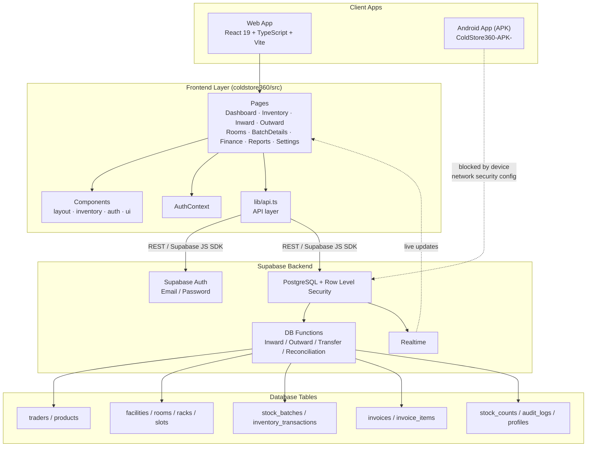

# ❄️ ColdStore360

**ColdStore360** is a full-stack web application for operating a cold-storage warehouse end to end. It brings stock receiving, location-aware inventory, dispatch, billing, reconciliation, and reporting into a single role-protected workspace — built on a React + TypeScript frontend and a Supabase (PostgreSQL) backend, with a complete high-fidelity UI/UX design suite included.

---

## Table of Contents

- [Overview](#overview)
- [Team — Heaven's Door](#team--heavens-door)
- [Screenshots](#screenshots)
- [Capabilities](#capabilities)
- [Technology Stack](#technology-stack)
- [Architecture](#architecture)
- [Repository Structure](#repository-structure)
- [Application Pages](#application-pages)
- [API Endpoints](#api-endpoints)
- [Design Suite](#design-suite)
- [Android (APK) Version](#android-apk-version)
- [Getting Started](#getting-started)
- [Database Setup](#database-setup)
- [Scripts](#scripts)
- [Security & Data Integrity](#security--data-integrity)
- [Contributing](#contributing)
- [License](#license)

---

## Overview

Cold-storage facilities need to track *where* stock physically sits (room and slot), *who* it belongs to (trader), *what* it is (product/batch), and *how it moves* (receiving, dispatch, transfer, reconciliation) — all while staying billable and auditable. ColdStore360 centralizes this into one application with real-time dashboards, capacity-aware storage, and role-based access for administrators, managers, gate staff, and warehouse staff.

---

## Team — Heaven's Door

This project was built by **Team Heaven's Door**.

| Member | Primary Role |
| --- | --- |
| **Avenash V** | Database |
| **Surya** | Frontend |
| **Nithilan** | Backend |

> Although each member owned a primary role, the team worked collaboratively across every layer of the stack — frontend, backend, and database — supporting one another to deliver the project efficiently as a unit.

---

## Screenshots

<!--
  Add product screenshots below. Recommended: Dashboard, Inventory, Inward/Outward,
  Finance, and the mobile app view. Reference screens are already available under
  `stitch_coldstore360_operations_suite (1)/.../<screen>/screen.png`.
-->

| Screen | Preview |
| --- | --- |
| Dashboard | _add screenshot here_ |
| Inventory | _add screenshot here_ |
| Inward / Receiving | _add screenshot here_ |
| Finance | _add screenshot here_ |
| Mobile (APK) | _add screenshot here_ |

```md
<!-- Example once images are added to a /screenshots folder -->

```

---

## Capabilities

### Warehouse Operations
- Receive stock against a trader and product, then place it in a specific room and slot.
- Dispatch stock, transfer it between locations, and retain a full transaction history per batch.
- Track capacity at both room and slot level — available, occupied, full, maintenance, and inactive states.
- Inspect inventory by batch, trader, product, room, or slot.

### Business Management
- Manage traders, products, storage rooms, and slots.
- Generate invoices and calculate storage duration for dispatched batches.
- Reconcile physical counts against system inventory with accountable adjustment records.
- View operational dashboards, reports, recent activity, and real-time inventory alerts.

### Access Control
- Email/password authentication via Supabase Auth.
- Protected application routes on the client.
- Role-based database access policies (Row Level Security) for administrators, managers, gate staff, and warehouse staff.

---

## Technology Stack

| Area | Tools |
| --- | --- |
| Client | React 19, TypeScript, Vite |
| Routing | React Router |
| Data fetching / caching | TanStack Query |
| Forms & validation | React Hook Form, Zod |
| UI & charts | Tailwind CSS, Lucide React, Recharts |
| Backend | Supabase (PostgreSQL, Auth, Realtime, Row Level Security) |
| Linting | Oxlint |
| Design | Stitch-generated operations suite (HTML/CSS design system) |

---

## Architecture



> **Note:** The Android APK build currently cannot reach the Supabase backend from a mobile device due to the device's network/security configuration (see [Android (APK) Version](#android-apk-version)) — the dotted line above reflects that known limitation.

---

## Repository Structure

```text
ColdStore360/
├── coldstore360/                          # Main application (React + TS + Supabase)
│   ├── public/                            # Static assets (favicon, icons)
│   ├── src/
│   │   ├── assets/                        # Images (hero, logos)
│   │   ├── components/
│   │   │   ├── auth/                      # ProtectedRoute
│   │   │   ├── inventory/                 # StockTransferModal
│   │   │   ├── layout/                    # DashboardLayout
│   │   │   └── ui/                        # ActionDropdown and shared UI
│   │   ├── contexts/                      # AuthContext
│   │   ├── lib/                           # Supabase client (supabase.ts) & API helpers (api.ts)
│   │   ├── pages/                         # Routed feature pages (see below)
│   │   ├── App.tsx / App.css              # Root component & global styles
│   │   ├── index.css
│   │   └── main.tsx                       # App entry point
│   ├── supabase/
│   │   ├── migrations/                    # Versioned PostgreSQL schema & RLS policy changes
│   │   ├── auth_setup.sql                 # Auth/profile bootstrap
│   │   ├── seed.sql                       # Optional demo warehouse data
│   │   └── seed_billing.sql               # Optional demo billing data
│   ├── index.html
│   ├── package.json
│   ├── tailwind.config.js
│   ├── vite.config.ts
│   ├── tsconfig*.json
│   └── README.md                          # App-specific setup guide
│
└── stitch_coldstore360_operations_suite (1)/
    └── stitch_coldstore360_operations_suite/
        ├── coldstore360_logistics/DESIGN.md   # Design tokens (colors, typography, spacing)
        ├── login/                              # Login screen design (code.html + screen.png)
        ├── sign_up/                             # Sign-up screen design
        ├── admin_dashboard/                     # Dashboard screen design
        ├── inventory_management/                # Inventory screen design
        ├── receive_stock_storage_assignment/     # Stock receiving/storage design
        ├── batch_details/                        # Batch details screen design
        ├── finance_overview/                     # Finance screen design
        └── settings/                              # Settings screen design
```

---

## Application Pages

The `coldstore360/src/pages` directory contains the following routed views:

| Page | Purpose |
| --- | --- |
| `Login`, `SignUp` | Authentication |
| `Dashboard` | Operational overview, alerts, recent activity |
| `Inventory` | Inventory browsing by batch/trader/product/room/slot |
| `Inward` | Stock receiving workflow |
| `Outward` | Stock dispatch workflow |
| `Rooms`, `RoomDetails` | Storage room & slot capacity management |
| `BatchDetails` | Full transaction history for a batch |
| `Traders`, `Products` | Master data management |
| `Reconciliation` | Physical vs. system stock reconciliation |
| `Finance` | Invoicing and storage-duration billing |
| `Reports` | Operational and business reports |
| `Settings` | Application/account configuration |

---

## API Endpoints

ColdStore360 doesn't run a custom REST server — the client talks directly to **Supabase's auto-generated PostgREST API** and **Supabase Auth**, wrapped by a typed API layer in [`coldstore360/src/lib/api.ts`](coldstore360/src/lib/api.ts). The functions below are effectively the app's API surface:

### Auth
| Function | Description |
| --- | --- |
| Supabase Auth (`signUp`, `signInWithPassword`, `signOut`) | Handled via `AuthContext` / `supabase.auth.*` |

### Traders & Products
| Function | Table | Description |
| --- | --- | --- |
| `getTraders()` | `traders` | List active traders |
| `createTrader()` | `traders` | Create a trader |
| `deactivateTrader()` | `traders` | Deactivate a trader |
| `getProducts()` | `products` | List products |
| `deactivateProduct()` | `products` | Deactivate a product |

### Locations
| Function | Table | Description |
| --- | --- | --- |
| `getFacilities()` | `facilities` | List facilities |
| `getRooms(facilityId?)` | `rooms` | List rooms, optionally by facility |
| `getRacks(roomId?)` | `racks` | List racks, optionally by room |
| `getSlots(rackId?)` | `slots` | List slots, optionally by rack |

### Inventory
| Function | Table(s) | Description |
| --- | --- | --- |
| `getInventoryBatches()` | `stock_batches` | List all inventory batches |
| `getAvailableBatchesForTrader(traderId)` | `stock_batches` | Batches available for a trader |
| `deleteInventoryBatch(batchId)` | `stock_batches` | Delete a batch |
| `clearAllInventory()` | `stock_batches`, `inventory_transactions`, `stock_counts` | Wipe demo/test inventory |

### Warehouse Movements
| Function | Table(s) | Description |
| --- | --- | --- |
| `processInward(inwardData)` | `stock_batches`, `inventory_transactions` | Receive new stock into a room/slot |
| `transferStock(transferData)` | `stock_batches` | Move stock between locations |
| `processOutward(outwardData)` | `stock_batches`, `inventory_transactions` | Dispatch stock out of the warehouse |

### Billing
| Function | Table(s) | Description |
| --- | --- | --- |
| `getInvoices()` | `invoices` | List invoices |
| `getUninvoicedBatches(traderId)` | `stock_batches` | Batches pending invoicing for a trader |
| `generateInvoice(traderId, batchIds, ratePerDay?)` | `invoices`, `invoice_items` | Generate an invoice for storage duration |
| `markInvoiceAsPaid(invoiceId)` | `invoices` | Mark an invoice as paid |

### Reconciliation
| Function | Table(s) | Description |
| --- | --- | --- |
| `getStockCounts()` | `stock_counts` | List physical stock counts |
| `logStockCount(data)` | `stock_counts`, `stock_batches`, `inventory_transactions`, `audit_logs` | Log a physical count and reconcile discrepancies |

### Dashboard
| Function | Table(s) | Description |
| --- | --- | --- |
| `getDashboardMetrics()` | `stock_batches`, `traders`, `invoices`, `stock_counts` | Aggregate operational metrics |
| `getRecentTransactions()` | `inventory_transactions` | Latest transaction feed |

> All requests are automatically scoped by **Supabase Row Level Security (RLS)** based on the authenticated user's role — no endpoint returns data the caller isn't authorized to see.

---

## Design Suite

The `stitch_coldstore360_operations_suite (1)/` folder contains a complete Stitch-generated **operations suite design system** for ColdStore360 — high-fidelity HTML/CSS mockups (`code.html`) and reference screenshots (`screen.png`) for every core screen (Login, Sign Up, Dashboard, Inventory Management, Receive Stock, Batch Details, Finance Overview, Settings), plus a `DESIGN.md` defining the shared design tokens (color palette, typography scale, spacing, and border-radius system) used to keep the UI visually consistent. The style direction is described as **"Functional Minimalism"** — an industrial, high-density, purely operational aesthetic suited to warehouse management tooling.

---

## Android (APK) Version

An Android build of ColdStore360 is available in a separate repository:

🔗 **[ColdStore360-APK-](https://github.com/Avenash005/ColdStore360-APK-)**

**Status:** The Android app is built and functional, but on-device internet access to the Supabase backend is currently **blocked by the mobile device's network/security configuration** — so the app cannot reach the backend when installed and run directly on a physical Android device.

**To run and verify the app:**
1. Clone the [ColdStore360-APK-](https://github.com/Avenash005/ColdStore360-APK-) repository.
2. Open the project in **Android Studio**.
3. Run it on an **emulator** (or a device with the appropriate network security configuration adjusted), where backend access works as expected.

This is a known, open issue — contributions to fix the network/security configuration for real-device use are welcome.

---

## Getting Started

### Prerequisites
- Node.js 18 or later
- A Supabase project

### 1. Install dependencies
```bash
cd coldstore360
npm install
```

### 2. Configure environment variables
Create a `.env` file inside `coldstore360/`:
```env
VITE_SUPABASE_URL=https://your-project.supabase.co
VITE_SUPABASE_ANON_KEY=your-anon-key
```
Never commit `.env` files or Supabase service-role keys — `.gitignore` already excludes `.env`.

### 3. Apply the database schema
See [Database Setup](#database-setup) below.

### 4. Start the application
```bash
npm run dev
```
Open the local URL shown by Vite (normally `http://localhost:5173`). Create an account at `/signup`, then assign an appropriate role in the `profiles` table if required by your deployment.

---

## Database Setup

ColdStore360's schema and access policies live under `coldstore360/supabase/`:

- `migrations/` — versioned PostgreSQL schema and Row Level Security policy changes, applied in timestamp order.
- `auth_setup.sql` — authentication/profile bootstrap.
- `seed.sql` / `seed_billing.sql` — optional demo warehouse and billing data.

Recommended: use the Supabase CLI for repeatable deployments.
```bash
npm install -g supabase
supabase login
supabase link --project-ref YOUR_PROJECT_REF
supabase db push
```

Alternatively, run the migration files in order through the Supabase SQL Editor. See `coldstore360/supabase/README.md` (if present in your checkout) for further operational guidance and any legacy-database migration notes.

---

## Scripts

Run from inside `coldstore360/`:

| Command | Description |
| --- | --- |
| `npm run dev` | Start the Vite development server |
| `npm run build` | Type-check and build the production bundle |
| `npm run lint` | Run Oxlint |
| `npm run preview` | Serve a locally built production bundle |

---

## Security & Data Integrity

ColdStore360 relies on Supabase **Row Level Security** for database-level access control. Inventory movements use database functions to validate active locations and capacity, update occupancy, create inventory transactions, and write audit events together, atomically. Avoid changing quantity or capacity columns directly during normal operations — use the receiving, dispatch, transfer, and reconciliation workflows instead.

---

## Contributing

1. Create a branch from `main`.
2. Make focused changes; keep database changes in a new timestamped migration.
3. Run `npm run lint` and `npm run build` before opening a pull request.
4. Describe any required environment, schema, or deployment changes in the pull request.

---

## License

No license has been specified for this repository.
